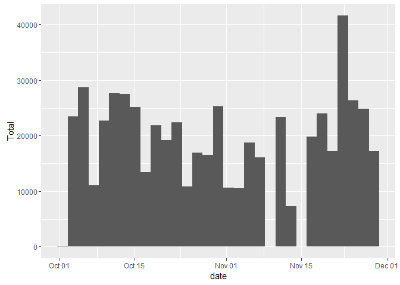
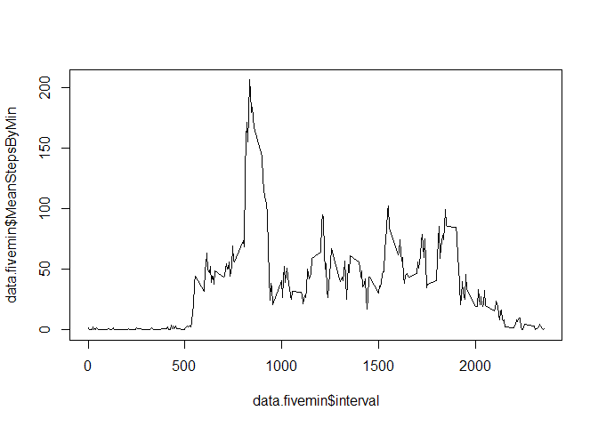
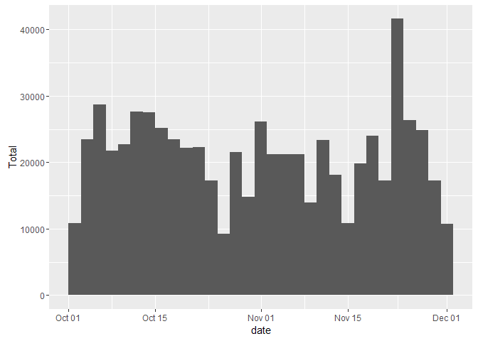
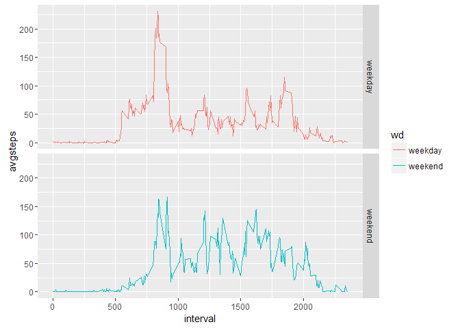

# Reproducible Research: Peer Assessment 1


## Loading and preprocessing the data
First we read the data:
<!-- message=FALSE turns off the library load output. -->

```r
library(lubridate)
library(dplyr)
library(ggplot2)
library(xtable)
```

```
## Warning: package 'xtable' was built under R version 3.2.5
```

```r
options("scipen"=100, "digits"=3)
setwd("C:\\Users\\Tom\\Documents\\GitHub\\RepData_PeerAssessment1")
data.raw = read.csv(unz("activity.zip", "activity.csv"), header=T, quote="\"", sep=",")
```

## What is mean total number of steps taken per day?

```r
steps.mean = mean(data.raw$steps, na.rm = TRUE)
steps.sum = sum(data.raw$steps, na.rm = TRUE)
```

*This next number was requested on the course website, but not in the github instructions?*

Excluding NA's, the total number of steps is **570608**.

###Total number of steps taken each day:

```r
data.summary = data.raw %>% 
        filter(!is.na(steps)) %>% 
        group_by(date=ymd(date)) %>% 
        summarise(Total = sum(steps))
ggplot(data.summary, aes(date, Total)) + 
        stat_summary_bin(fun.y="sum", geom="bar")
```

<!-- -->

```r
dailymean = mean(data.summary$Total)
dailymedian = median(data.summary$Total)
```

Excluding NA's, the mean number of daily steps was **10766.189**, and the daily median was **10765**.


## What is the average daily activity pattern?

```r
data.fivemin = data.raw %>% 
        filter(!is.na(steps)) %>% 
        group_by(interval) %>%
        summarise(MeanStepsByMin=mean(steps))
plot(data.fivemin$interval, data.fivemin$MeanStepsByMin, type="l")
```

<!-- -->

```r
peakinterval = top_n(data.fivemin, 1, MeanStepsByMin)
```

The peak interval, when measured by averaging every 5 minute interval across all days, was **Interval #835**


## Imputing missing values
First, we'll replace NA's with the average for a given interval.

```r
nacount = count(data.raw %>% filter(is.na(steps)))
data.filled = left_join(data.raw, data.fivemin, by="interval") %>% 
        mutate(newsteps = ifelse(is.na(steps),MeanStepsByMin,steps)) 
```

There are **2304** NA 'steps' in this dataset.

Next, we'll plot the new histogram, and calculate the differences

```r
data.summaryfilled = data.filled %>% 
        group_by(date=ymd(date)) %>% 
        summarise(Total = sum(newsteps))
ggplot(data.summaryfilled, aes(date, Total)) + 
        stat_summary_bin(fun.y="sum", geom="bar")
```

<!-- -->

```r
dailyfilledmean = mean(data.summaryfilled$Total)
dailyfilledmedian = median(data.summaryfilled$Total)
```

With projected NAs, the mean number of daily steps was **10766.189** (a difference of **0**), and the daily median was **10765** (a difference of **1.189**).

## Are there differences in activity patterns between weekdays and weekends?
Yes, the weekday ramps up more quickly, and the weekend has higher activity in the evenings:

```r
data.weekdaysummary = data.filled %>% 
        mutate(wd = weekdays(as.POSIXct(date))) %>%
        group_by(wd=ifelse(wd=="Saturday","weekend", ifelse(wd=="Sunday","weekend","weekday")), interval) %>%
        summarise(avgsteps = mean(newsteps))
ggplot(data.weekdaysummary, aes(interval, avgsteps, color=wd)) + geom_line() + facet_grid(wd~.)
```

<!-- -->
